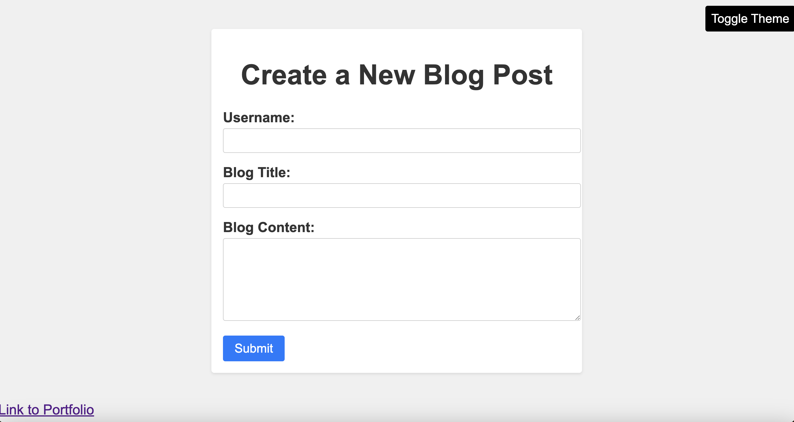

# My First Blog

## Description

My motivation to create this project was to make a page where I could enter blog posts and keep track of them. I built this project to make blogging easier and to create a space where I can share my thoughts. This site solves the problem of not having a place to write blogs and record them. I learned how to use JavaScript to send and retrive data across two pages.

## Deployed Site

The deployed website can be reached at the following link.

https://stefanfilm.github.io/MyFirstBlog/posts.html

## Installation

To install the project, pull the code from https://github.com/stefanfilm/myfirstblog and open it in a code editor. Open the script.js or postsscript.js file in the code editor and view the JavaScript. You could open the index.html file in a browser to see the code function.

## Usage

To use the website, enter text into the Username, Blog Title, and Blog Content text areas. Once you complete your blog post, press Submit to add it to the blog. The website will direct you to another page where the blog will post. You could toggle the theme to Dark Mode by pressing the Toggle Theme button. 

    ```md
    
    ```

## Credits

I worked on this project under the instruction of Mark Carlson in the UC Berkeley Software Developer Bootcamp.

## License

The license is an MIT license. Please refer to the GitHub Repository for details on the license. 

## Badges


